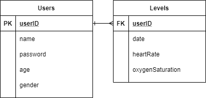
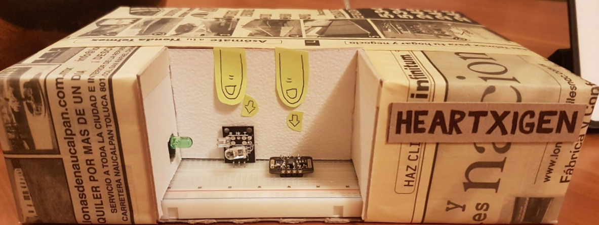

# Implementación de internet de las cosas
## Equipo
- Lourdes Badillo, A01024232
- Martha del Río, A01023890
- Valeria Pineda González, A01023979
- Eduardo Villalpando, A01023646

## Descripción
A finales del 2019, se registró en Wuhan, China el primer caso de SARS-CoV-2,
conocido coloquialmente como nuevo coronavirus o simplemente COVID-19. En pocos meses se esparció por todo el mundo, ocasionando una pandemia con millones de muertos. Se recomienda a la población vigilar de cerca su salud para poder detectar cualquier síntoma. Por ello se propone elaborar un dispositivo que monitoree signos vitales tales como
frecuencia cardiaca y nivel de oxigenación sanguínea y detecte anomalías.

## Estructura de la base de datos

## Prototipo
El prototipo que desarrollamos para poder hacer la validación del proyecto hasta
ahora es el siguiente: 

## Links
[Reporte Final](https://github.com/louloubadillo/Equipo_no_1_RetoIot/blob/master/reporte-final.pdf)  
[Presentación Final](https://github.com/louloubadillo/Equipo_no_1_RetoIot/blob/master/presentacion-final.pdf)  
[Video Demo](https://drive.google.com/file/d/1R83law_UAyPZw8W-DAwB0inEFGdTMzqJ/view?usp=sharing) 