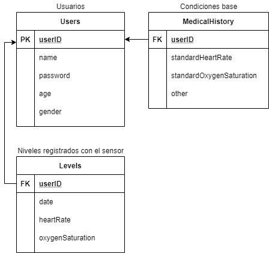

# Implementación de internet de las cosas
## Equipo 1
- Lourdes Badillo, A01024232
- Martha del Río, A01023890
- Valeria Pineda González, A01023979
- Eduardo Villalpando, A01023646

## Estructura de la base de datos

## Reto
El reto de IoT se desarrolla en cuatro etapas: 

1. Identificación del problema

2. Diseño conceptual 

3. Implementación del prototipo

4. Validación

